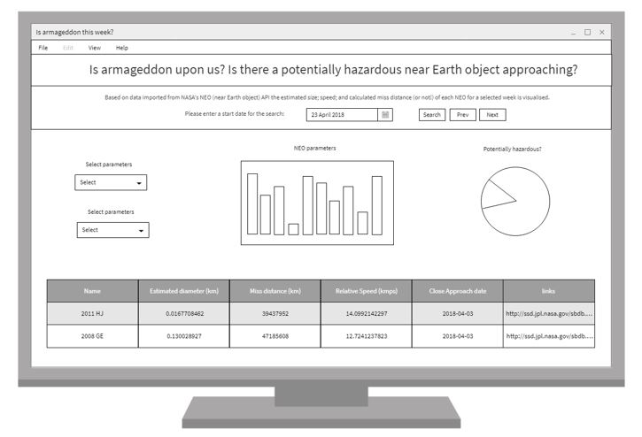
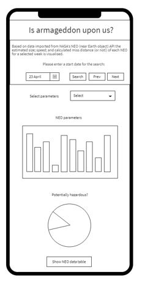
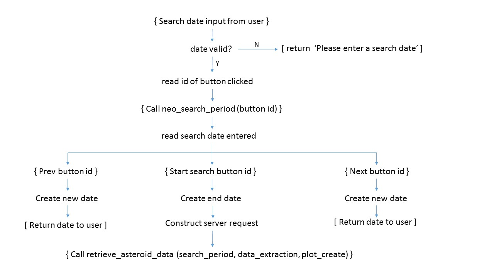
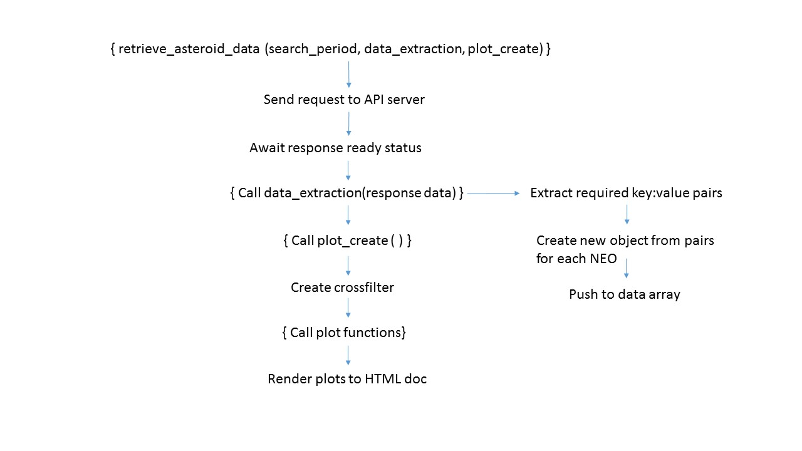

# Near Earth Object Data Visualisation: Milestone Project 2
    
This project provides a data dashboard of the Near Earth objects (NEO's) undertaking close approaches to Earth in a specified time period with the start date specified by the user.
Data is obtained from a NASA API which provides NEO information over a maximum 7 day period. This data dashboard obtains the data from the API; extracts the relevent data; post processes 
this data; and provides a visualisation of the NEO objects' date of close approach; estimated maximum diameter; Earth miss distance at its point of closest approach; and the potential hazard 
of these NEO's to Earth.

This data dashboard is aimed at the scientific community and can be utilised by astronomers to identify opportunities to view NEOs on a specific date; it could also be utilised by engineers 
planning space missions to a NEO and would allow a range of suitable targets to be identified for a specified launch date.
  
## User Experience Design

This website focuses on providing easily digestible information on the NEOs with close approaches over a specified time period. With this aim in mind, the website will
have an uncomplicated page layout with simple data plots which focus on the most important details of the NEOs. These important details are:

* Close approach date
* Estimated diameter of the NEO
* Earth miss distance
* Potential hazard to Earth

The website will therefore use the close approach date as the basis of these plots and with a single plot displaying each of the important details stated above. Furthermore,
to improve the digestability of the information: a red/blue/green (altered traffic light) colour scheme will be implemented with the most dangerous aspects of the
NEO displayed in red and those least hazardous displayed in green.

### User Stories

With aim of appealling to the scientific community, in addition to those with passing interest in the subject area, the following user stories have been defined:
 
#### Astronomer
 
I'm an astronomer and I woud like to find out which asteroids are making their close aproaches to Earth on Tuesday, which is going to be a clear evening, so that I can potentially view them. 

Process:  the astronomer accesses the website and types in the search date for Tuesday, they can then filter the results by that date and decide which astreoid would be best suited to view.

#### Engineer/engineering student

I'm an engineer (or engineering student) conducting a feasibility study on a satellite orbiting a NEO. I have a specified launch date of 2020-10-09 and would be in a position to inject into a NEO transfer orbit
by 2020-10-25 at the earliest. What NEOs would offer the best solution for a successful mission?

Process: The engineer would access the website and put in a date of 2020-10-25, this would then produce a range of information for potential targets for the mission. Additionally, dependent upon
the timescales available the engineer could define potential NEO targets months or even years in advance.

#### Doomsayers

I'm a Doomsayer and believe the world will end on 2025-09-01 what NEO could this be and what information can I get on it?

Process: The doomsayer would access the website and put in the relevant date, this would then produce a range of potentially hazardous near Earth objects to get 
excited about with important information about them.

 
### Wireframes

The layout for the website is defined on a desktop as shown in the wireframe below:

The layout consists of a site title, followed by a search section. This search consists of an input box to allow a search date to be entered and buttons to allow 
the search to be initiated or to alter the initial start date of the search. This is followed by the data output section which consists of the data output plots followed 
by a table of NEO data. The layout of the site will be configured using Bootstrap's grid system to allow responsive layout over different media. The configuration of the 
website on smaller screen resolutions is shown below:

Again, the site title is at the top of the screen followed by the search input area, both of which take up the full width of the screen. This is folowed by
the data output area but, in this case, each plot takes up the entire width of the screen. This is achieved using bootstrap's grid configuration. At smaller screen
resolutions, the table area of the site is hidden as this would not provide a high quality display of information due to width constraints.

### User feedback

User feedback will be provided within the search input area by a the generation of a calendar upon focus on the input box. In addition to this, when an incorrect date 
is entered text will be displayed that will notify the user that the date entered is incorrect. Additionally, the text colour will change on the search buttons when 
the mouse enters or leaves the button. This change will be a subtle as possible by the application of a transition duration to the event handler.

## Code Overview

A brief description of the code used to develop the project and its purpose is given below. This is segemented into code developed for the HTML, CSS, and Javascript documents of the project.

### HTML: index.html

The html document is separated into two main areas: the first being the search input area and the second is the data output display area. Both of these are contained within the content display
area of the html document.

#### Content display area

The content display area is a 'div' element which contains all the content to be displayed to the page user. At smaller screen resolutions, 991px screen resolutions and below, 
the content display area fills 100% of the screen width. At screen resolutions of 992px and above a left and right margin is applied to the content display area to allow a backgorund 
image to border the content display area.

#### Site title

The site title is generated as a part of the bootstrap grid system and is contained with a div  of class 'col-12' to ensure that it takes up the full width of the screen.

#### NEO search date 

In this section the user is given information on the purpose of the site. In addition to this, there is an input area to enter a start date for the NEO search and there are buttons which:

* start the NEO search
* change start date to the previous week
* change start date to the next week

The search input area uses the bootstrap grid system to maintain layout over the full range of screen resolutions. The area is separated into two columns each with a width of 12. 
The first column contains a ‘p’ element which contains the descriptive text for the website. Additionally, it contains an input box for the user to select a date to begin a NEO search. 
Upon focus, the input box will display a calendar which allows a date to be selected or alternatively a date can be manually entered. The second column contains the buttons used to begin 
the search or to change the date in the input box to the previous or next weeks. These buttons were styled using Bootstrap. If no date is selected within the input box and one of the buttons
is pressed: the input box will display the text: ‘Please enter a date’. If the date entered is in an incorrect format thenan alert will be displayed stating that 'An invalid date has been 
entered'.

Prior to any data visualisations being generated the 'prev' and 'next' buttons will only change the date within the input box. However, if the data visualisations have been generated then the 
data will be automatically updated to the week selected in the input box.

#### Data output display area

The data dashboard is split into four rows using Bootstrap's grid system. The first row is split into two columns each of width 6 with the column heading and plot centered within. 
The first column contains a composite line chart displaying object counts for the total number of NEOs; total number of potentially hazardous NEOs; total number of NEOs with an Earth 
miss distance less than 10 million km; and the total number of NEOs with an estimated maximum diameter greater than 2 km for each date of the search period specified. This has a column 
width of 6 and the heading and plot are centered within the cloumn. The second column contains a stacked bar chart which counts the number of NEOs with estimated maximum diameters within 
a specified range with close approaches to Earth on each date of the search period specified.

The second row is again split into two columns each of width 6 with the column heading and plot centered within.. The first column contains a stacked bar chart which counts the number of NEOs
with Earth miss distances within a specified range with close approaches to Earth on each date of the search period specified. The second column contains a pie chart displaying the proportion
of potentially hazardous NEOs to those that are not hazardous.

The third row is a single column of width 12 with the text centered within the column. This displays a count of the filtered data to the total data count. In addition to this a 'Reset All' link based on code obtained from [reference 1]
can be used to reset all the data plots and remove all chart filters.

The fourth row contains two columns each of width 12 with the text in each centered. The first is the title for the data table and below this there are two buttons that allow the data displayed
in the table below to be toggled between the 'Top 10 closest approaches' and 'All approaches'. These buttons were styled using Bootstrap. The second column is a data table displaying 
information of NEOs with the closest aproaches to Earth by defualt over the specified time period, with or without data filters applied. Though this can be toggled to show data on 
all approaches.

At smaller screen resolutions all data plots and the table, with the exception of the pie chart, utilise the overflow-x property so that plots which exceed the screen dimensions won't affect
the page layout.

Finally, at the bottom of the page is an anchor which allows the user to return to the top of the page without affecting the data visualisations.

#### CSS: style.css

The HTML document was styled by calling the style.css document within the head of the document. CSS was developed using SASS in the style.scss document and mapped to the style.css document using 
the sass --watch style.scss command in the css folder within the command terminal. 

A background image of space is used to fill the entire page area and is used to border the content display area when margins are applied to it and to provide space themed imagery prior to data 
output generation. Media queries [ref x] are used to alter the font size of the text throughout this section dependent upon the screen resolution it is being viewed on. Media query breakpoints were 
defined as follows:
 
* Extra-small screen maximum width breakpoint: 576px
* Small screen maximum width breakpoint: 768px
* Medium screen maximum width breakpoint: 992px
* Large screen maximum width breakpoint: 1200px

Additionally, these media queries were used to alter the column width of the data outputs to a width of 12, at smaller screen resolutions, so that each data plot column would use the full 
width of the screen available.

Furthermore, the overflow-x porperty was utilised on the container elements of the data plots and the tables, at smaller screen resolutions, to ensure that the page layout would be 
maintained at these screen sizes.

### Javascript: main.js

The flow of the javascript code from the point of entering a valid date into the html input box to the point of rendering the data output plots to the html document is shown in the flow diagrams below.

A brief description of each of the functions used in the main.js document is given in the following sections, below.

#### Datepicker 

A datepicker function [ref 1] is used to generate the calendar for date selection. This function is called when the html date selection input box is activated. The date format used
is YYYY-MM-DD.

#### JQuery event handling 

##### Calendar modal
A JQuery event handler is used to add a class to the calendar modal box when focus is activated on the input box. This class styles the background of the calendar. 

##### Search buttons
The 'previous week', 'start search' and 'next week' buttons are used as JQuery selectors with attached event handler functions and additional coding for incorrect inputs.
This is undertaken as follows:
Upon click: the value within the input box is read and the date is parsed. An If-else statement is utilised as follows:

If the parsed date has a value greater than zero then the ID of the button clicked is converted to a string, this value is untilised by the 'neo_search_period' function
later in the script. A nested If-else statement is then utilised. This is used to check whether the data visualisations have been generated previously by means of checking 
whether the data-display region has a hidden class associated with it. If the data display region does have a class 'hidden' [ref x], i.e. data hasn't been previously generated, then 
a variable is created with the value 'false'. If the 'hidden' class is not associated with the data display region the variable will take a value of 'true'. Once the nested If-else statement
has concluded the neo_search_period function is called with the button ID and whether it has the associated 'hidden' class as its input arguments.

The else portion of the outer If-else statement is undertaken if the parsed date is less than zero. In this case the following text is displayed in the input box: 'Please enter a date'.
In addition to this the user is alerted that 'An invalid date has been entered'.

###### Table update buttons

Once the data visualisations are visible then the table update buttons can be used to toggle between different data amounts displayed in the tables. In addition to this, the
data visualisations will be reset so that filtering can be applied to the new table data. These both work as follows:

Upon button click: 

The table title is updated to the correct text and a variable n is generated dependent upon the button clicked and the amount of data to be displayed.
The variable 'n' is then used as an argument in the 'plot create' function which generates all the data visualisations. By default the value of 'n' is set to 10.

##### Return function

Upon click of the anchor at the bottom of the HTML page, a 'topfunction()' is used to return the user to the top of the HTML page.

##### Page links

When the mouse enters an anchor on the HTML page this triggers an change in color of the anchor text. This returns to its original colour when the mouse leaves the anchor text.

#### Function: neo_search_period (argument 1, argument 2)

Once the 'neo_search_period' function has been called the function reads the start date from the html input box and from this creates a new Date() object instance. The input arguments 
to this functions are the ID of the button clicked and the data-output-state which determines whether or not the data visualisations have been generated previously.
One of three actions, based upon the html button id of the input argument of the function and the use of an If-else-if-else statement, is then performed.

##### Start-search

The search_start function is called with the start search date and the new Date object as its input arguments.

##### Previous week start date

If the 'previous week' button has been selected a second Date() object instance is created which is 8 days prior to the start date of the html input box. The 'date_format'
function is utilised to format the date and this is then written to the html input box.

This new Date object is then set as the start date for the search and a new Date is object is created. An If statement is then used to check if the data visualisations have 
been generated previously, i.e. the second input argument to the neo_search_period function is true,  and if they have then the search_start function is called with the start 
search date and the new Date object as its first and second input arguments, respectively. This allows automatic update of the data visualisations when the data visualisations 
have been generated previously.

##### Next week start date

If the 'next week' button has been selected a second Date() object instance is created which is 8 days after the start date of the html input box. The 'date_format'
function is again utilised to format the date and this is then written to the html input box.

Similarly to the 'prev' button function this will check whether data visualisations have been generated previously and if they have this will update the visualisations for the 
following week from the initial start date.

##### search_start(argument 1, argument 2)

This function has the start date for the search as its first argument and the new Date object created as its second argument. This new date, 
or search end date, is used as an input argument to the 'date_format' function [REF 2] which formats the date in the form YYYY-MM-DD. The start and end dates generated 
are then used as inputs for the construction of the data request to be sent to the API server. Once the server request function is constructed, 
the 'retrieve_asteroid_data' function is called with the server request being the first of its three input arguments.

#### Function: retrieve_asteroid_data (argument 1, argument 2, argument 3)

 When called, with the required three arguments, this function will contact the API server using the previously constructed server request from the first input argument.
 A new XMLHttpRequest is created and a 'GET' request to retrieve the object for the specified time period is sent to the server. Once the request has been processed by the 
 server and the response is ready; a callback function data_create(), which is the second input argument to this function, is called with the server response as its input argument. 
 This function is used to select information of interest from the returned object. Finally, a second callback function, print(), is called which is the third input argument to this 
 function and is used to generate the data visualisations for the dashboard.
 
 Once the print() function has been called the display_data function is called which removes the 'hidden' class from the data display area which reveals the generated data 
 visualisations.

#### Function: data_extraction (argument 1)

This function is passed as the second argument when the 'retrieve_asteroid_data' function is called. The data received from the server is used as its input argument and
using the object keys of the data received, data for each individual NEO object is obtained. An empty object is created for each NEO object and the relevant data for the
NEO object is added to create a new object with only the required information. Each new object created is pushed to an array which, when populated for each NEO object,
is used as the data for the visualisation.

#### Function: plot_create ( )

This function is called as the third input argument to the 'retrieve_asteroid_data' function. This function creates a crossfilter for the data using the array created by the 
'data_extraction' function. The variable names for each of the data plots are then defined externally to the chart generation functions so that they can be accessed at a global 
level and are accessible to reset calls. The functions containing the plot generation code are then called using the crossfilter data and the variable names for the input data 
plots as the two input arguments. Finally, the call to render all data plots is implemented.

#### Function: miss_distance (argument 1, argument 2, argument 3)

This function is used to group the data based on the Earth miss distance of the NEO. The function has three input arguments, the first is the dimension about which to 
group the data. The second is the minimum value of the miss distance and the third argument is the maximum value of the miss distance. The latter two input arguments are used to 
create lower and upper boundaries for the miss distance data. When the function is called the total number of NEO objects within the specified miss distance boundaries is returned.

#### Function: estimated_diameter (argument 1, argument 2, argument 3)

This function is used to group the data based on the estimated maximum diameter of the NEO. The function has three input arguments, the first is the dimension about which to 
group the data. The second is the minimum value of the estimated diameter and the third argument is its maximum value. The latter two input arguments are used to 
create lower and upper boundaries for the data. When the function is called the total number of NEO objects within the specified estimated maximum diameter boundaries is returned.

#### Function: number_hazardous_objects (argument 1, argument 2)

This function creates a composite line plot using the crossfilter data as the first argument and the chart variable name as its second argument. The dates for the NEO search are parsed
to ensure they are in the correct format for the software to understand. The date dimension is then created for the plot using these parsed dates. The top and bottom rows of the parsed 
date array are then extracted and are used to create the domain for the chart. 

This composite chart consists of four groups with the date the dimension for each one. The first of which is the total number of NEO's for a 
specific date. This is calculated using anonymous functions to return the daily total. The second group is a count of the total number of potentially hazardous NEOs for a particular date. 
This total is obtained using an IF statement which only adds to the total if the value is equal to 'true'. The third group is a count of the total number of NEOs on that date which have
an Earth miss distance less than 10 million km. This is obtained by calling the miss_distance function which the correct input arguments. Finally, the fourth group is a count of the 
total number of NEOs with an estimated maximum diameter greater than 2km. This total is obtained by calling the estimated_diameter function with the correct arguments.

#### Function: close_approach_stack (argument 1, argument 2)

This function creates a stacked bar chart using the crossfilter data as the first argument and the chart variable name as its second argument. The dimension used for this chart are the 
close approach dates extracted directly from the crossfilter. The group used for the chart is obtained by using the miss_distance function with correct arguments and produces a count of
the number of NEOs with a miss distance less than 10 million km. The two stacks are miss distance between 10 and 50 million km and a miss distance of 50 million km and above. The object 
count for the stacked portions of the chart are obtained by calling the miss_distance function with the correct input arguments.

#### Function: estimated_diameter_stack (argument 1, argument 2)

This function creates a stacked bar chart using the crossfilter data as the first argument and the chart variable name as its second argument. The dimension used for this chart are the 
close approach dates extracted directly from the crossfilter. The group used for the chart is obtained by using the estimated_diameter function with correct arguments and produces a 
count of the number of NEOs with an estimated maximum diameter less than 1 km. The two stacks are an estimated maximum diameter between 1 and 2 km and an estimated maximum diameter of 
2 km and above. The object count for the stacked portions of the chart are obtained by calling the estimated_diameter function with the correct input arguments.
 
#### Function: potential_hazard (argument 1, argument 2)

This function creates a pie chart using the crossfilter data as the first argument and the chart variable name as its second argument. The dimension is created using an IF statement
which returns 'YES' if the potential hazard to Earth's object value is 'true', otherwise the statement returns 'NO'. The returned values are then used as the group for the pie chart.

#### Function: neo_count (argument 1, argument 2)

This function creates a count of the total number of objects filtered and the total number of objects counted and was obtained using the code found here [ref 2]. 
The function is called using the crossfilter data as the first argument and the chart variable name as its second argument.

#### Function: neo_data_table (argument 1, argument 2, argument 3)

This function creates a table of NEOs with the ten closest approach distances and was obtained using the code found here [reference x].
The function is called using the crossfilter data as the first argument;  the chart variable name as its second argument and the size 'n' of the table as its third argument. It is 
the third argument which allows the table data to be changed upon button click between 'Top 10 closest approaches' and 'All approaches'. 

### Features Left to Implement

A very cool feature which I'm not sure if it exists would be a Solar System equivalent of Google Maps. Here the current position of the selected NEOs would be displayed at the current 
time or at a chosen time. An additional feature could be a user selected end date which would allow the user to select a search period of less than 7 days, which is the maximum search period
available from the API. Unfortunately, I have investigated whether the actual time of close approach of the NEO was available from the API but it is not and this would be a very useful addition.
One final feature would be a timeout for the API request which would alert the user if there was an issue with the server that the request was sent to.

### API Issues
Over the course of the development of the project the NASA API has experienced server problems on three occasssions. On one of these occassions no repsonse from the server was obatined and 
this lasted the entirety of a weeekend. On the other two occassions the server was responding but would not return the full compliment of NEO object data and only returned a subset of this data. 

## Technologies Used

The following technologies were used during the development of this project:

* [JQuery](https://jquery.com/) was used for event handlers during the project. For example, when a button was clicked the id of that button was obtained and code written to pass that button id to a separate function.
* [Crossfilter](http://square.github.io/crossfilter/) is a Javascript library for utilising large datasets within the website and was used to manipulate the NEO object data obtained from the API. 
* [dc.js](https://dc-js.github.io/dc.js/) is a Javascript library for data visualization and analysis it was utilised to produce the interactive data plots for the website.
* [d3](https://d3js.org/) is a JavaScript library for manipulation based on data. This was used to bind data to the output plots.
* [Bootstrap](https://getbootstrap.com/) is an open  source framework for the development of HTML, CSS and JS. It was used in this project to control the layout of the website using the grid system.
* [sass](https://sass-lang.com/) is an extension of CSS which allows for quick and easy organisation of the CSS. It was used to maintain clear and easy styles for the website and was mapped to the the stylesheet of the project.
* [Google Fonts](https://fonts.google.com/) allows font styles to be added to the text of the website. This was used to specify the font used in the website.

## Code Validation 

Each HTML page of the site was run through the [W3C markup validation Service](https://validator.w3.org/) and the CSS was run through the [W3C css validation Service](https://jigsaw.w3.org/css-validator/). 
The results of the validator can be found here:

[index.html](https://github.com/chrismurray1980/neo-data-milestone-project/blob/master/static/img/w3_html_validation.pdf)
[style.css](https://github.com/chrismurray1980/neo-data-milestone-project/blob/master/static/img/w3_css_validation.pdf)

##  Testing

The following tests were defined and undertaken for each of the sections of the code identified. Each test is assigned a Test I.D., a description of the test undertaken is given 
and the test result (i.e. whether it passed or failed is stated).

### Search Date Input

#### Calendar modal

| Test I.D.     | Description                                                                           | Result|
| ------------- |:-------------------------------------------------------------------------------------:| -----:|
| T1            | Focus on the input text box and ensure that the calendar modal appears                | pass  |
| T2            | The calendar modal has a been styled using the CSS style sheet                        | pass  |
| T3            | The 'prev' and 'next' buttons change the calendar month                               | pass  |
| T4            | The current month and year are the default display of the calendar modal              | pass  |
| T4            | Upon a date selection, this value is diplayed in the input box with format YYYY-MM-DD | pass  |

#### Date validation check

| Test I.D.     | Description                                                                                                                           | Result|
| ------------- |:-------------------------------------------------------------------------------------------------------------------------------------:| -----:|
| T5            | Enter a random number in the date input box and ensure that an window alert is displayed when the start search button is pressed      | pass  |
| T6            | Enter letters into the input box and ensure these are not displayed                                                                   | pass  |
| T7            | Enter dates in DD-MM-YYYY and MM-DD-YYYY formats and ensure that an window alert is displayed when the start search button is pressed | pass  |
| T8            | Enter a date in YYYY-MM-DD and ensure that the plots are generated when the start search button is pressed                            | pass  |

### Search Buttons

#### Start Search

| Test I.D.     | Description                                                                                                                           | Result|
| ------------- |:-------------------------------------------------------------------------------------------------------------------------------------:| -----:|
| T9            | The data visualisations are generated for the 7 day period from the start date selected when the button is clicked                    | pass  |
| T10           | An alert is generated on click when an invalid date is entered                                                                        | pass  |
| T11           | Data visualisations are updated upon click for new selected user start date for the correct time period                               | pass  |

#### Previous Week

| Test I.D.     | Description                                                                                                                                             | Result|
| ------------- |:-------------------------------------------------------------------------------------------------------------------------------------------------------:| -----:|
| T12           | An alert is generated on click when an invalid date is entered                                                                                          | pass  |
| T13           | If no data visualisations have been generated upon click the start date will be updated within the input box which is 8 days prior to the current value | pass  |
| T14           | If plots have been generated previously upon click the start date will be updated as well as the data visualisations for the selected period            | pass  |

#### Next Week

| Test I.D.     | Description                                                                                                                                             | Result|
| ------------- |:-------------------------------------------------------------------------------------------------------------------------------------------------------:| -----:|
| T15           | An alert is generated on click when an invalid date is entered                                                                                          | pass  |
| T16           | If no data visualisations have been generated upon click the start date will be updated within the input box which is 8 days after the current value    | pass  |
| T17           | If plots have been generated previously upon click the start date will be updated as well as the data visualisations for the selected period            | pass  |

### Data Visualisations

#### Close approaches per day composite chart

| Test I.D.     | Description                                                                                                                                             | Result|
| ------------- |:-------------------------------------------------------------------------------------------------------------------------------------------------------:| -----:|
| T18           | Upon legend highlight, the selected line will be highlighted and the remainder will fade                                                                | pass  |
| T19           | Upon line point highlight, correct information for that line at its highlighted point is displayed                                                      | pass  |
| T20           | The chart responds to filters applied to other charts in the data visualisation display area                                                            | pass  |

#### Estimated maximum NEO diameter stacked bar chart

| Test I.D.     | Description                                                                                                                                             | Result|
| ------------- |:-------------------------------------------------------------------------------------------------------------------------------------------------------:| -----:|
| T21           | Upon legend highlight, the selected bar portion will be highlighted and the remainder will fade                                                         | pass  |
| T22           | Upon bar chart portion highlight, correct information for that highlighted portion of the chart is displayed                                            | pass  |
| T23           | The chart responds to filters applied to other charts in the data visualisation display area                                                            | pass  |
| T24           | The chart is filtered when a selected area of the chart is clicked                                                                                      | pass  |

#### Earth miss distance stacked bar chart

| Test I.D.     | Description                                                                                                                                             | Result|
| ------------- |:-------------------------------------------------------------------------------------------------------------------------------------------------------:| -----:|
| T25           | Upon legend highlight, the selected bar portion will be highlighted and the remainder will fade                                                         | pass  |
| T26           | Upon bar chart portion highlight, correct information for that highlighted portion of the chart is displayed                                            | pass  |
| T27           | The chart responds to filters applied to other charts in the data visualisation display area                                                            | pass  |
| T28           | The chart is filtered when a selected area of the chart is clicked                                                                                      | pass  |

#### Potentially hazardous to Earth pie chart

| Test I.D.     | Description                                                                                                                                             | Result|
| ------------- |:-------------------------------------------------------------------------------------------------------------------------------------------------------:| -----:|
| T29           | Upon legend click, the selected bar portion will be highlighted and the remainder will fade                                                             | pass  |
| T30           | Upon pie chart portion highlight, correct information for that highlighted portion of the chart is displayed                                            | pass  |
| T31           | The chart responds to filters applied to other charts in the data visualisation display area                                                            | pass  |
| T32           | The chart is filtered when a selected area of the chart is clicked                                                                                      | pass  |

#### NEO object count

| Test I.D.     | Description                                                                                                                                             | Result|
| ------------- |:-------------------------------------------------------------------------------------------------------------------------------------------------------:| -----:|
| T33           | Upon filtering of other charts the correct number of filtered objects is displayed as well as the total number of objects                               | pass  |
| T34           | Upon click of the 'Reset All' link, all data on the page is reset                                                                                       | pass  |

#### Data table 

##### Table buttons

| Test I.D.     | Description                                                                                                                                              | Result|
| ------------- |:--------------------------------------------------------------------------------------------------------------------------------------------------------:| -----:|
| T35           | The default display of the table is the 'Top 10 closest approaches'                                                                                      | pass  |
| T36           | Upon click of the 'All' button the table title is updated to 'All Approaches' and all object data is displayed in the table for the selected time period | pass  |
| T37           | Upon click of the 'Top 10' button the table title is updated to 'Top 10 closest approaches' and only the top 10 miss distances are shown                 | pass  |

##### URL links in table

| Test I.D.     | Description                                                                                                                                              | Result|
| ------------- |:--------------------------------------------------------------------------------------------------------------------------------------------------------:| -----:|
| T38           | The URL's in the table open in a new tab                                                                                                                 | pass  |
| T39           | The information on the page opened corresponds to the information for that data entry                                                                    | pass  |

### Page Configuration

#### Page links

| Test I.D.     | Description                                                                                                                                              | Result|
| ------------- |:--------------------------------------------------------------------------------------------------------------------------------------------------------:| -----:|
| T40           | Page links change colour on mouse enter and return to normal when the mouse leaves them                                                                  | pass  |
| T41           | All clicked links open in a new tab, with the exception of the 'Reset All' link for data visualisation                                                   | pass  |

#### Media queries and layout

| Test I.D.     | Description                                                                                                                                              | Result|
| ------------- |:--------------------------------------------------------------------------------------------------------------------------------------------------------:| -----:|
| T42           | All text is legible and overflow of the data visualisations works correctly at the minimum screen width of 356px                                         | pass  |
| T43           | All text is legible and overflow of the data visualisations works correctly at each media query breakpoint                                               | pass  |
| T44           | Page layout is as intended at all screen sizes and the bootstrap gird system has been correctly implemented                                              | pass  |

#### User stories

| Test I.D.     | Description                                                                                                                                              | Result|
| ------------- |:--------------------------------------------------------------------------------------------------------------------------------------------------------:| -----:|
| T45           | Is each user story defined achievable and easy to execute                                                                                                | pass  |

## Project Deployment 

The project was deployed using GitHub and is published here: [Near Earth Object Close Approach Data Visualisation](https://chrismurray1980.github.io/neo-data-milestone-project/).

## References

1. Reset all: http://blockbuilder.org/blacklionb6/72c73e70b0588fc0964477fca999aa73
2. Table in dc.js: https://github.com/austinlyons/dcjs-leaflet-untappd
4. Number precision: https://developer.mozilla.org/en-US/docs/Web/JavaScript/Reference/Global_objects/Number/toPrecision
5. Date format: https://jsfiddle.net/taditdash/8FHwL/
6. Date format: https://jqueryui.com/datepicker/
7. Datepicker format: https://stackoverflow.com/questions/1328025/jquery-ui-datepicker-change-date-format
8. valid date format https://stackoverflow.com/questions/28227862/how-to-test-a-string-is-valid-date-or-not-using-moment/30240547
9. Final js date code: https://stackoverflow.com/questions/3552461/how-to-format-a-javascript-date
10. class not present https://stackoverflow.com/questions/7841048/how-to-check-if-an-element-does-not-have-a-specific-class
11. Object properties: https://dmitripavlutin.com/how-to-iterate-easily-over-object-properties-in-javascript/
12. Search sort: https://gist.github.com/onpubcom/1772996
13. Push to array: https://stackoverflow.com/questions/12491101/javascript-create-array-from-for-loop
14. Add function for array: https://medium.com/@chrisburgin95/rewriting-javascript-sum-an-array-dbf838996ed0
15. Iterate through object keys: http://pietschsoft.com/post/2015/09/05/JavaScript-Basics-How-to-create-a-Dictionary-with-KeyValue-pairs
16. Callback functions: https://www.dashingd3js.com/lessons/javascript-callback-functions
17. Ticks on x-axis: https://stackoverflow.com/questions/21497359/d3-js-change-format-of-price-and-date
18. JQuery animate: https://stackoverflow.com/questions/4347104/jquery-animate-css
19. Sass media query: http://thesassway.com/intermediate/responsive-web-design-in-sass-using-media-queries-in-sass-32

