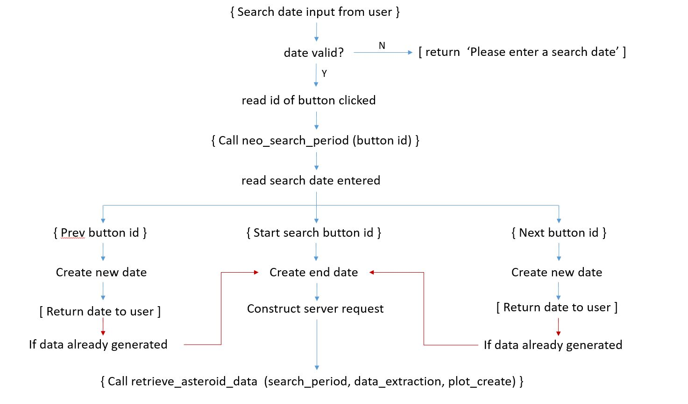

# Near Earth Object Data Visualisation: Milestone Project 2
    
This project provides a data dashboard of the Near Earth objects (NEO's) undertaking close approaches to Earth in a specified time period. 
Data is obtained from a NASA API which provides NEO information over a maximum 7 day period. This data dashboard obtains the data from the API; extracts the relevent data; post processes this data; 
and provides a visualisation of the NEO objects' date of close approach; estimated diameter; Earth miss distance at its point of closest approach; and the potential hazard of these NEO's to Earth.

This data dashboard is aimed at the scientific community and can be utilised by astronomers to identify opportunities to view NEOs on a specific date; it could also be utilised by engineers planning space missions
to a NEO and would allow a range of suitable targets to be identified for a specified launch date.
  
## User Experience Design

Use this section to provide insight into your UX process, focusing on who this website is for, what it is that they want to achieve and how your project is the best way to help them achieve these things.

This website focuses on providing easily digestible information on the NEOs with close approaches over a specified time period. With this aim in mind, the website will
be clear with simple data plots which focus on the most important details of the NEO. These important details are:

* Close approach date
* Estimated diameter of the NEO
* Earth miss distance
* Potential hazard to Earth

The website will therefore use the close approach date as the basis of these plots and with a single plot displaying each of the following important details. Furthermore,
to improve the digestability of the information: a red/blue/green (altered traffic light) colour scheme will be implemented with the most dangerous aspects of the
NEO displayed in red.

### User Stories

With aim of appealling to the scientific community, in addition to those with passing interest in the subject area, the following user stories have been defined:
 
#### Astronomer
 
I'm an astronomer and I woud like to find out which asteroids are making their close aproaches to Earth on Tuesday so that I can view them. 

Process:  the astronomer accesses the website and types in the search date for Tuesday, they can then filter the results by that date and decide which astreoid would be best suited 

#### Engineer/engineering student

I'm an engineer (or engineering student) conducting a feasibility study on a satellite orbiting a NEO. I have a specified launch date of 2020-10-09 and would be in a position to inject into a trans-NEO orbiting
by 2020-10-25. What NEOs would offer the best solution for a successful mission.

Process: The engineer would access the website and put in a date of 2020-10-25, this would then produce a range of information for potential targets for the mission.

#### Doomsayers

I'm a Doomsayer and I would like to know if armageddon is going to happen this week.

Process: The doomsayer would access the website and put in today's date, this would then produce a range of potentially hazardous near Earth objects to get 
excited about.

 
### Wireframes

The layout for the website is defined on a desktop as shown in the wireframe below:

The layout consists of a site title, followed by a search section. This search consists of an input box to allow a search date to be entered and buttons to allow 
the search to be initiated or to alter the initial start date of the search. This is followed by the data output section which consists of the data output plots followed by a table of NEO data. The layout of the site will be configured using 
Bootstrap's grid system to allow responsive layout over different media. The configuration of the website on smaller screen resolutions is shown below:

Again, the site title is at the top of the screen followed by the search input area, both of which take up the full width of the screen. This is folowed by
the data output area but, in this case, each plot takes up the entire width of the screen. This is achieved using bootstrap's grid configuration. At smaller screen
resolutions, the table area of the site is hidden as this would not provide a high quality display of information due to width constraints.

### User feedback

User feedback will be provided within the search input area by a the generation of a calendar upon focus on the input box. In addition to this, when an incorrect date 
is entered text will be displayed that will notify the user that the date entered is incorrect. Additionally, the text colour will change on the search buttons when 
the mouse enters or leaves the button. This change will be a subtle as possible by the application of a transition duration to the event handler.

## Code Overview

A brief description of the code used to develop the project and its purpose is given below. This is segemented into code developed for the HTML, CSS, and Javascript documents of the project.

### HTML: index.html

The html document is separated into two main areas: the first being the search input area and the second is the data output display area. Both of these are contained within the content display area of the html
document.

#### Content display area

The content display area is a 'div' element which contains all the content to be displayed to the page user. At smaller screen resolutions, 991px screen resolutions and below, 
the content display area fills 100% of the screen width. At screen resolutions at 992px and above a left and right margin is applied to the content display area to allow a backgorund image to border the content display area.

#### Site title

The site title is generated as a part of the bootstrap grid system and is contained with a div  of class 'col-12' to ensure that it takes up the full width of the screen.

#### NEO search date 

In this section the user is given information on the purpose of the site. In addition to this, there is an input area to enter a start date for the NEO search and there are buttons which:

* start the NEO search
* change start date to the previous week
* change start date to the next week

The search input area uses the bootstrap grid system to maintain layout over the full range of screen resolutions. The area is separated into two columns each with a width of 12. 
The first column contains a ‘p’ element which contains the descriptive text for the website. Additionally, it contains an input box for the user to select a date to begin a NEO search. Upon focus, the input box will display a calendar which allows a date to be selected or alternatively a date can be manually entered.
The second column contains the buttons used to begin the search or to change the date in the input box to the previous or next weeks.
If no date is selected within the input box and one of the buttons is pressed: the input box will display the text: ‘Please enter a date’.

#### Data output display area

The data dashboard is split into four rows using Bootstrap's grid system. The first row is split into two columns each of width 6 with the column heading and plot centered within. 
The first column contains a composite line chart displaying object counts for the total number of NEOs; total number of potentially hazardous NEOs; total number of NEOs with an Earth miss distance 
less than 10 million km; and the total number of NEOs with an estimated maximum diameter greater than 2 km for each date of the search period specified. This has a column width of 6 and the heading 
and plot are centered within the cloumn. The second column contains a stacked bar chart which counts the number of NEOs with estimated maximum diameters within a specified range 
with close approaches to Earth on each date of the search period specified.

The second row is again split into two columns each of width 6 with the column heading and plot centered within.. The first column contains a stacked bar chart which counts the number of NEOs with 
Earth miss distances within a specified range with close approaches to Earth on each date of the search period specified. The second column contains a pie chart displaying the proportion of potentially hazardous NEOs 
to those that are not hazardous.

The third row is a single column of width 12 with the text centered within the column. This displays a count of the filtered data to the total data count. In addition to this a 'Reset All' link based on code obtained from [ref x]
can be used to reset all the data plots and remove all chart filters.

The fourth row contains two columns each of width 12 with the text in each centered. The first is the title for the data table and the second column is a data table displaying information of NEOs with the 
closest aproaches to Earth over the specified time period, with or without data filters applied. In addition to this, the fourth row is hidden at smaller screen resolutions to simplify the layout and 
display on mobile devices.

#### CSS: style.css

The HTML document was styled by calling the style.css document within the head of the document. CSS was developed using sass in the style.scss document and mapped to the style.css document. 

A background image of space is used to fill the entire page area and is used to border the content display area when margins are applied to it and to provide space themed imagery prior to data output generation.
Media queries are used to alter the font size of the text throughout this section dependent upon the screen resolution it is being viewed on. Media query breakpoints were defined as follows:
 

* Extra-small screen maximum width breakpoint: 576px
* Small screen maximum width breakpoint: 768px
* Medium screen maximum width breakpoint: 992px
* Large screen maximum width breakpoint: 1200px

Additionally, these media queries were used to alter the column width of the data outputs to a width of 12 so that each data plot column would use the full width of the screen available.

### Javascript: main.js

The flow of the javascript code from the point of entering a valid date into the html input box to the point of rendering the data output plots to the html document is shown in the flow diagrams below.

A brief description of each of the functions used in the main.js document is given in the following sections, below.

#### Datepicker 

A datepicker function [ref 1] is used to generate the calendar for date selection. This function is called when the html date selection input box is activated. The date format used
is YYYY-MM-DD.

#### JQuery event handling 

A JQuery event handler is used to add a class to the calendar modal box when focus is activated on the input box. This class styles the background of the calendar. 

The 'previous week', 'start search' and 'next week' buttons are used as JQuery selectors with attached event handler functions and additional coding for incorrect inputs.
If an incorrect date is entered, or the date input field is empty, and any of the buttons are activated the following text is displayed in the input box: 'Please enter a date'. 
In addition to this, user feedback for the buttons is provided by mouseenter and mouseleave events triggering a change in button text colour.

Once a valid start date has been entered the id of the html button element is obtained and this is passed as an argument into the main data generation function called 'neo_search_period'.
 
Finally, upon activation of the 'start search button' with a suitable search date, a two second delay is activated to allow the plots to be generated then the class which is hiding 
the data output area is removed revealing the generated data output. 

#### Function: neo_search_period (argument 1)

Once the 'neo_search_period' function has been called the function reads the start date from the html input box and from this creates a new Date() object instance. 
One of three actions, based upon the html button id of the input argument of the function and the use an IF statement, is then performed.

##### Start-search: server request construction

If the 'start search' button has been selected the function creates a second Date() object instance which is seven days greater than the starting date. This new date, 
or search end date, is used as an input argument to the 'date_format' function [REF 2] which formats the date in the form YYYY-MM-DD. The start and end dates generated 
are then used as inputs for the construction of the data request to be sent to the API server. Once the server request function is constructed, 
the 'retrieve_asteroid_data' function is called with the server request being the first of its three input arguments.

##### Previous week start date

If the 'previous week' button has been selected a second Date() object instance is created which is 8 days prior to the start date of the html input box. The 'date_format'
function is again utilised to format the date and this is then written to the html input box.

##### Next week start date

If the 'next week' button has been selected a second Date() object instance is created which is 8 days after the start date of the html input box. The 'date_format'
function is again utilised to format the date and this is then written to the html input box.

#### Function: retrieve_asteroid_data (argument 1, argument 2, argument 3)

 When called, with the required three arguments, this function will contact the API server using the previously constructed server request from the first input argument.
 A new XMLHttpRequest is created and a 'GET' request to retrieve the object for the specified time period is sent to the server. Once the request has been processed by the 
 server and the response is ready; a callback function data_create(), which is the second input argument to this function, is called with the server response as its input argument. 
 This function is used to select information of interest from the returned object. Finally, a second callback function, print(), is called which is the third input argument to this 
 function and is used to generate the data visualisations for the dashboard.

#### Function: data_extraction (argument 1)

This function is passed as the second argument when the 'retrieve_asteroid_data' function is called. The data received from the server is used as its input argument and
using the object keys of the data received, data for each individual NEO object is obtained. An empty object is created for each NEO object and the relevant data for the
NEO object is added to create a new object with only the required information. Each new object created is pushed to an array which, when populated for each NEO object,
is used as the data for the visualisation.

#### Function: plot_create ( )

This function is called as the third input argument to the 'retrieve_asteroid_data' function. This function creates a crossfilter for the data using the array created by the 
'data_extraction' function. The variable names for each of the data plots are then defined externally to the chart generation functions so that they can be accessed at a global 
level and are accessible to reset calls. The functions containing the plot generation code are then called using the crossfilter data and the variable names for the input data 
plots as the two input arguments. Finally, the call to render all data plots is implemented.

#### Function: miss_distance (argument 1, argument 2, argument 3)

This function is used to group the data based on the Earth miss distance of the NEO. The function has three input arguments, the first is the dimension about which to 
group the data. The second is the minimum value of the miss distance and the third argument is the maximum value of the miss distance. The latter two input arguments are used to 
create lower and upper boundaries for the miss distance data. When the function is called the total number of NEO objects within the specified miss distance boundaries is returned.

#### Function: estimated_diameter (argument 1, argument 2, argument 3)

This function is used to group the data based on the estimated maximum diameter of the NEO. The function has three input arguments, the first is the dimension about which to 
group the data. The second is the minimum value of the estimated diameter and the third argument is its maximum value. The latter two input arguments are used to 
create lower and upper boundaries for thedata. When the function is called the total number of NEO objects within the specified estimated maximum diameter boundaries is returned.

#### Function: number_hazardous_objects (argument 1, argument 2)

This function creates a composite line plot using the crossfilter data as the first argument and the chart variable name as its second argument. The dates for the NEO search are parsed
to ensure they are in the correct format for the software to understand. The date dimension is then created for the plot using these parsed dates. The top and bottom rows of the parsed date array 
are then extracted and are used to create the domain for the chart. 

This composite chart consists of four groups with the date the dimension for each one. The first of which is the total number of NEO's for a 
specific date. This is calculated using anonymous functions to return the daily total. The second group is a count of the total number of potentially hazardous NEOs for a particular date. This total is obtained using
an IF statement which only adds to the total if the value is equal to 'true'. The third group is a count of the total number of NEOs on that date which have an Earth miss distance less than 10 million km. This is obtained by 
calling the miss_distance function which the correct input arguments. Finally, the fourth group is a count of the total number of NEOs with an estimated maximum diameter greater than 2km. This total is obtained by
calling the estimated_diameter function with the correct arguments.

#### Function: close_approach_stack (argument 1, argument 2)

This function creates a stacked bar chart using the crossfilter data as the first argument and the chart variable name as its second argument. The dimension used for this chart are the 
close approach dates extracted directly from the crossfilter. The group used for the chart is obtained by using the miss_distance function with correct arguments and produces a count of the number of NEOs with
a miss distance less than 10 million km. The two stacks are miss distance between 10 and 50 million km and a miss distance of 50 million km and above. The object count for the stacked portions of the chart are obtained 
by calling the miss_distance function with the correct input arguments.

#### Function: estimated_diameter_stack (argument 1, argument 2)

This function creates a stacked bar chart using the crossfilter data as the first argument and the chart variable name as its second argument. The dimension used for this chart are the 
close approach dates extracted directly from the crossfilter. The group used for the chart is obtained by using the estimated_diameter function with correct arguments and produces a count of the number of NEOs with
an estimated maximum diameter less than 1 km. The two stacks are an estimated maximum diameter between 1 and 2 km and an estimated maximum diameter of 2 km and above. The object count for the stacked portions of the chart are obtained 
by calling the estimated_diameter function with the correct input arguments.
 

#### Function: estimated_diameter_stack (argument 1, argument 2)

This function creates a pie chart using the crossfilter data as the first argument and the chart variable name as its second argument. The dimension is created using an IF statement which returns 'YES' if the
potential hazard to Earth's object value is 'true', otherwise the statement returns 'NO'. The returned values are then used as the group for the pie chart.

#### Function: neo_count (argument 1, argument 2)

This function creates a count of the total number of objects filtered and the total number of objects counted and was obtained using the code found here [ref 2]. 
The function is called using the crossfilter data as the first argument and the chart variable name as its second argument.

#### Function: neo_data_table (argument 1, argument 2)

This function creates a table of NEOs with the ten closest approach distances and was obtained using the code found here [ref 3].
The function is called using the crossfilter data as the first argument and the chart variable name as its second argument.

### Features Left to Implement

Code to more thoroughly check that a valid date has been entered into the text box is required. For example, if you enter a number into the search box which is not in a valid date format no code will execute. 
Also, I would like to add the time of close approach of the asteroid to the data output as this would be a useful feature for those wishing to view the asteroid through as telescope.
Additionally, a very cool feature which I'm not sure if it exists would be a Solar System equivalent of Google Maps. Here the current position of the selected NEOs would be displayed at the current time or at a chosen time. 
In addition to this, I would like to spend some time investigating how difficult it would be to make the dc.js data plots responsive using CSS. I am aware that they can be manipulated by the CSS but the time required to achieve this
may be prohibitive. 

## Technologies Used
In this section, you should mention all of the languages, frameworks, libraries, and any other tools that you have used to construct this project. For each, provide its name, a link to its official site and a short sentence of why it was used.

The following technologies were used during the development of this project:

* [JQuery](https://jquery.com/) was used for event handlers during the project. For example, when a button was clicked the id of that button was obtained and code written to pass that button id to a separate function.
* [Crossfilter](http://square.github.io/crossfilter/) is a Javascript library for utilising large datasets within the website and was used to manipulate the NEO object data obtained from the API. 
* [dc.js](https://dc-js.github.io/dc.js/) is a Javascript library for data visualization and analysis it was utilised to produce the interactive data plots for the website.
* [d3](https://d3js.org/) is a JavaScript library for manipulation based on data. This was used to bind data to the output plots.
* [Bootstrap](https://getbootstrap.com/) is an open  source framework for the development of HTML, CSS and JS. It was used in this project to control the layout of the website using the grid system.
* [sass](https://sass-lang.com/) is an extension of CSS which allows for quick and easy organisation of the CSS. It was used to maintain clear and easy styles for the website and was mapped to the the stylesheet of the project.
* [Google Fonts](https://fonts.google.com/) allows font styles to be added to the text of the website. This was used to specify the font used in website.

## Code Validation 

##  Testing

| Tables        | Are           | Cool  |
| ------------- |:-------------:| -----:|
| col 3 is      | right-aligned | $1600 |
| col 2 is      | centered      |   $12 |
| zebra stripes | are neat      |    $1 |

In this section, you need to convince the assessor that you have conducted enough testing to legitimately believe that the site works well. Essentially, in this part you will want to go over all of your user stories from the UX section and ensure that they all work as intended, with the project providing an easy and straightforward way for the users to achieve their goals.
Whenever it is feasible, prefer to automate your tests, and if you've done so, provide a brief explanation of your approach, link to the test file(s) and explain how to run them.
For any scenarios that have not been automated, test the user stories manually and provide as much detail as is relevant. A particularly useful form for describing your testing process is via scenarios, such as:
    Contact form:
        Go to the "Contact Us" page
        Try to submit the empty form and verify that an error message about the required fields appears
        Try to submit the form with an invalid email address and verify that a relevant error message appears
        Try to submit the form with all inputs valid and verify that a success message appears.
In addition, you should mention in this section how your project looks and works on different browsers and screen sizes.
You should also mention in this section any interesting bugs or problems you discovered during your testing, even if you haven't addressed them yet.
If this section grows too long, you may want to split it off into a separate file and link to it from here.

## Project Deployment 

The project was deployed using GitHub and is published here: [Near Earth Object Close Approach Data Visualisation](https://chrismurray1980.github.io/neo-data-milestone-project/).

This section should describe the process you went through to deploy the project to a hosting platform (e.g. GitHub Pages or Heroku).
In particular, you should provide all details of the differences between the deployed version and the development version, if any, including:
    Different values for environment variables (Heroku Config Vars)?
    Different configuration files?
    Separate git branch?
In addition, if it is not obvious, you should also describe how to run your code locally.

## References

1. Clear input field text on refresh: https://stackoverflow.com/questions/52213/browser-refresh-behaviour

2. Placeholder text: https://www.w3schools.com/tags/att_input_placeholder.asp

3. Table in dc.js: https://github.com/austinlyons/dcjs-leaflet-untappd

4. Number precision: https://developer.mozilla.org/en-US/docs/Web/JavaScript/Reference/Global_objects/Number/toPrecision

5. Date format: https://jsfiddle.net/taditdash/8FHwL/

6. Date format: https://jqueryui.com/datepicker/

7. Datepicker format: https://stackoverflow.com/questions/1328025/jquery-ui-datepicker-change-date-format

8. Final js date code: https://stackoverflow.com/questions/3552461/how-to-format-a-javascript-date

9. Object properties: https://dmitripavlutin.com/how-to-iterate-easily-over-object-properties-in-javascript/

10. Search sort: https://gist.github.com/onpubcom/1772996

11. Push to array: https://stackoverflow.com/questions/12491101/javascript-create-array-from-for-loop

12. Add function for array: https://medium.com/@chrisburgin95/rewriting-javascript-sum-an-array-dbf838996ed0

13. Iterate through object keys: http://pietschsoft.com/post/2015/09/05/JavaScript-Basics-How-to-create-a-Dictionary-with-KeyValue-pairs

14. Callback functions: https://www.dashingd3js.com/lessons/javascript-callback-functions

15. Ticks on x-axis: https://stackoverflow.com/questions/21497359/d3-js-change-format-of-price-and-date

16. JQuery animate: https://stackoverflow.com/questions/4347104/jquery-animate-css

17. Sass media query: http://thesassway.com/intermediate/responsive-web-design-in-sass-using-media-queries-in-sass-32

18. Reset all: http://blockbuilder.org/blacklionb6/72c73e70b0588fc0964477fca999aa73

The link below provides an official example of an expected structure for your readme file, 
that if followed in its entirety should get you 4 marks out of 5 on the assessment. To get the maximum 5 marks, 
you would need to include all of the parts below and also tailor the readme to your own particular project, 
providing any additional relevant information useful to your users and other developers who may want to contribute to the project.

class not present
https://stackoverflow.com/questions/7841048/how-to-check-if-an-element-does-not-have-a-specific-class

valid date format
https://stackoverflow.com/questions/28227862/how-to-test-a-string-is-valid-date-or-not-using-moment/30240547

anchor in datatable
https://groups.google.com/forum/#!msg/dc-js-user-group/_NOGvYrUH8s/IUheoJP_2gQJ

MULTIPLE TITLE LABELS
https://github.com/dc-js/dc.js/issues/554